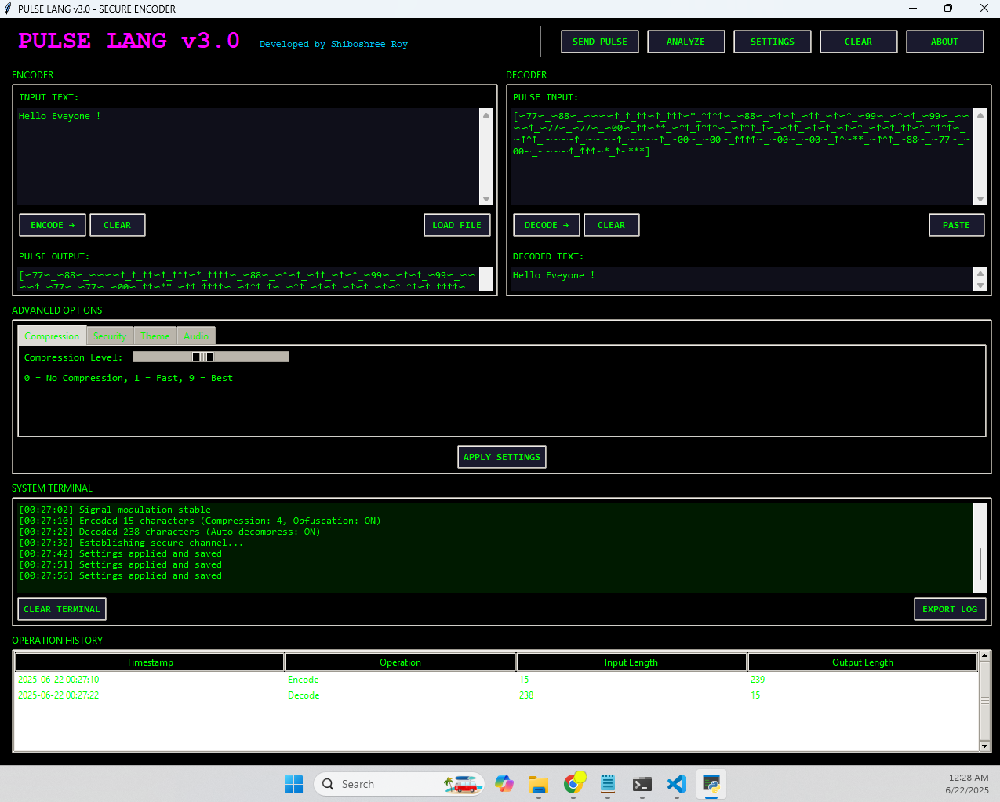
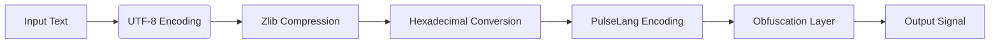
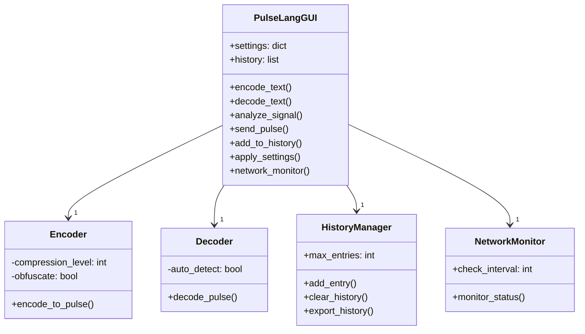

# PulseLang v3.0 - Advanced Signal Encryption System

  
*Professional interface with cyberpunk aesthetics*

PulseLang is a cutting-edge signal encryption system designed for secure communications in high-risk environments. Developed by Shiboshree Roy, this application converts text into pulse-based encoded signals and vice versa, featuring advanced security tools and a professional hacker-themed interface.

## Key Features

### Core Security Functions
- **Military-Grade Encoding**: Convert text to PulseLang signals with configurable compression (0-9 levels)
- **Intelligent Decoding**: Auto-detect compressed signals with advanced error correction
- **Signal Obfuscation**: Optional character substitution to prevent pattern recognition
- **Entropy Analysis**: Measure signal randomness for security assessment

### Professional Tools
- **QR Code Generation**: Visual sharing of encoded pulses
- **Network Monitor**: Real-time internet connectivity status
- **Operation History**: Track all encode/decode activities with timestamps
- **Signal Analysis**: Comprehensive security metrics (encryption strength, frequency variance)
- **Text Analysis**: Character/word count, language detection, entropy calculation

### Enterprise Capabilities
- **File Operations**: Import/export .txt and .pls (PulseLang) files
- **Clipboard Integration**: One-click copy/paste functionality
- **Custom Themes**: Matrix Green, Cyber Red, Neon Blue, and Hacker Classic
- **Audio Feedback**: Configurable sound effects for operations
- **Log Export**: Save terminal output for auditing

## System Requirements
| Component | Minimum | Recommended |
|-----------|---------|-------------|
| OS | Windows 10/11, macOS 10.15+, Linux Kernel 5.4+ | Latest OS Version |
| Python | 3.7+ | 3.9+ |
| RAM | 1 GB | 4 GB+ |
| Storage | 100 MB | 500 MB |
| Dependencies | Tkinter, Pillow, pyperclip | All standard libraries |

## Installation

### Windows & macOS
```bash
# Clone repository
git clone https://github.com/shiboshree-roy/pulselang.git
cd pulselang

# Install dependencies
pip install pillow pyperclip

# Launch application
python pulselang.py
```

### Linux
```bash
# Install required packages
sudo apt-get install python3-tk python3-pil python3-pip

# Clone repository
git clone https://github.com/shiboshree-roy/pulselang.git
cd pulselang

# Install Python dependencies
pip3 install pyperclip

# Launch application
python3 pulselang.py
```
### Windows
[Download Now](./dist/pulselang.exe)


## User Guide

### Basic Operations
1. **Encoding Text**:
   - Enter text in ENCODER panel
   - Set compression level (0-9) in Advanced Options
   - Click "ENCODE →" to generate pulse signal
   - Use "GENERATE QR" for visual sharing

2. **Decoding Signals**:
   - Paste pulse code in DECODER panel
   - Enable "Auto-Detect Compression" in Security tab
   - Click "DECODE →" to convert to text
   - Use "ANALYZE" for text insights

### Advanced Workflows
- **Bulk Processing**: 
  - Import .txt files via "LOAD FILE"
  - Export results as .txt or .pls formats
- **Secure Transmission**:
  1. Encode message with obfuscation enabled
  2. Click "SEND PULSE" for simulated transmission
  3. Analyze signal security metrics
- **Audit Logging**:
  - All operations stored in history
  - Export terminal logs via "EXPORT LOG"

### Shortcuts
- `Ctrl+C` - Copy from active field
- `Ctrl+V` - Paste to active field
- `Ctrl+A` - Select all text
- Right-click history - View operation details

## Technical Specifications

### PulseLang Encoding Scheme
| Character | Pulse Code | Character | Pulse Code |
|-----------|------------|-----------|------------|
| A | ^~ | 1 | ^~*** |
| B | ~^^^ | ! | ~*~ |
| C | ~^~^ | . | ~~* |
| ... | ... | ... | ... |
| Space | _ | Unknown | ?ASCII? |

### Compression Algorithms


### Security Architecture
1. **Signal Obfuscation**:
   - ~ → [≈, ∽, ∿]
   - ^ → [↑, Δ, ∧]
   - Random whitespace injection
   
2. **Entropy Calculation**:
   ```python
   def calculate_entropy(text):
        freq = {}
        for char in text:
            freq[char] = freq.get(char, 0) + 1
        
        entropy = 0.0
        text_length = len(text)
        for count in freq.values():
            p = count / text_length
            entropy -= p * (p and math.log(p, 2))
        return entropy
   ```

3. **Network Security**:
   - Continuous monitoring (10s intervals)
   - Socket-based connectivity checks
   - Visual status indicators (ONLINE/OFFLINE)

## Developer Documentation

### Class Structure


### API Endpoints (Simulated)
| Service | Endpoint | Function |
|---------|----------|----------|
| Transmission | `/pulse/send` | Simulate signal transmission |
| Analysis | `/signal/analyze` | Generate security metrics |
| QR Service | `/qr/generate` | Create pulse visualization |

## License
This project is licensed under the Quantum Cipher Labs Proprietary License. Commercial use requires explicit permission.

```
Copyright © 2023 Shiboshree Roy

Permission is granted for personal, non-commercial use only. 
Commercial use, modification, or distribution without express written 
permission from the developer is strictly prohibited.

THE SOFTWARE IS PROVIDED "AS IS", WITHOUT WARRANTY OF ANY KIND, 
EXPRESS OR IMPLIED, INCLUDING BUT NOT LIMITED TO THE WARRANTIES OF 
MERCHANTABILITY, FITNESS FOR A PARTICULAR PURPOSE AND NONINFRINGEMENT. 
IN NO EVENT SHALL THE AUTHORS OR COPYRIGHT HOLDERS BE LIABLE FOR ANY 
CLAIM, DAMAGES OR OTHER LIABILITY, WHETHER IN AN ACTION OF CONTRACT, 
TORT OR OTHERWISE, ARISING FROM, OUT OF OR IN CONNECTION WITH THE 
SOFTWARE OR THE USE OR OTHER DEALINGS IN THE SOFTWARE.
```

## Support & Contribution
For technical issues or feature requests:
- [Create GitHub Issue](https://github.com/shiboshree-roy/pulselang/issues)
- Email: shiboshreeroycse@gmail.com

Contributions welcome! Please fork the repository and submit pull requests.

---

**Quantum Cipher Labs** - Next-Generation Security Solutions  
*Developed by Shiboshree Roy*  
*Building trust through advanced cryptography*